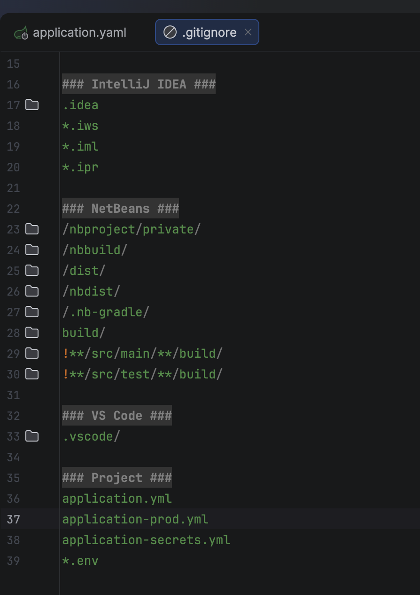
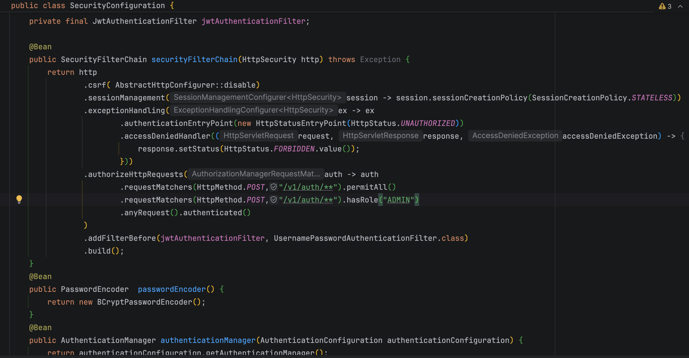
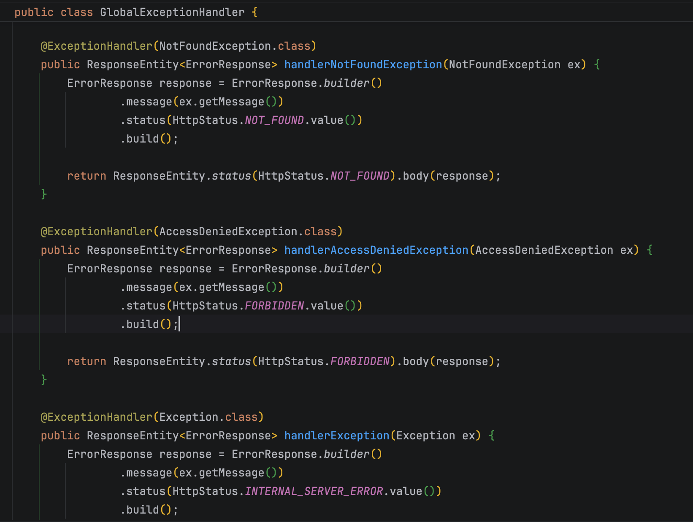

# Spring Essentials — JPA & Security Training

Projeto de estudo em Java com Spring Boot, feito para praticar dois pilares que aparecem em quase todo back-end: persistência de dados com Spring Data JPA e autenticação/autorização com Spring Security + JWT.

Esse README existe porque, quando eu estava aprendendo, sempre faltava alguém explicando o "por quê" por trás do código, não só o "o quê". Então é isso que tentei fazer aqui.

---

## Sobre o projeto

A API gerencia um domínio de treino/academia, com recursos como:

- Exercícios (criar, listar, listar por grupo muscular, deletar)
- Avaliações físicas de alunos
- Alunos (cadastro)
- Treinos
- Produtos
- Autenticação (registrar / login)

Esses endpoints foram testados via Postman, como mostra o print abaixo:



No print, o endpoint `POST /v1/auth/login` retorna um token JWT e o tempo de expiração (`expiresIn`). Esse token é o que a gente usa depois pra acessar as rotas protegidas.

---

## Parte 1 — Spring Data JPA

Spring Data JPA é o módulo do Spring que abstrai a comunicação com o banco de dados relacional. Em vez de escrever SQL na mão pra cada operação, você trabalha com entidades Java e interfaces de repositório, e o Spring gera as queries por baixo dos panos.

Conceitos usados neste projeto:

| Conceito | O que é | Onde entra aqui |
|---|---|---|
| `@Entity` | Anotação que transforma uma classe Java em tabela do banco | Exercicio, Avaliacao, Aluno, Treino, Produto |
| `JpaRepository<T, ID>` | Interface pronta do Spring com `save()`, `findById()`, `deleteById()` etc. | Evita escrever CRUD na mão pra cada entidade |
| Query Methods | Métodos como `findByGrupoMuscular(...)` | Usado em "Listar Exercícios By grupo" |
| DTOs | Classes que representam o formato de entrada/saída da API | Evita expor a entidade do banco direto no JSON |

### Fluxo de uma requisição

```
Cliente (Postman) → Controller → Service → Repository → Banco de Dados
```

1. O Controller recebe a requisição HTTP (ex: `POST /v1/exercicio`).
2. O Service aplica as regras de negócio.
3. O Repository, via Spring Data JPA, conversa com o banco.
4. A resposta volta em JSON.

Uma coisa que confunde bastante gente no começo: você quase nunca implementa o Repository na mão. Basta criar uma interface estendendo `JpaRepository`, e o Spring gera a implementação em tempo de execução.

---

## Parte 2 — Spring Security + JWT

Spring Security é o framework que decide quem pode acessar o quê dentro da aplicação. Aqui ele é combinado com JWT (JSON Web Token), um padrão de autenticação stateless — ou seja, sem guardar sessão no servidor.

### SecurityConfiguration

Essa classe centraliza a configuração de segurança:



O que cada trecho faz:

- `.csrf(AbstractHttpConfigurer::disable)` — desativa a proteção CSRF, comum em APIs REST stateless (CSRF importa mais em apps que usam sessão/cookies com formulários HTML).
- `.sessionManagement(... STATELESS)` — diz ao Spring pra não criar sessão HTTP. Cada requisição se autentica sozinha, geralmente enviando o JWT no header.
- `.exceptionHandling(...)` — define a resposta quando o usuário não está autenticado (`401`) ou não tem permissão (`403`).
- `.authorizeHttpRequests(...)` — define as regras de acesso por rota:
  - `POST /v1/auth/**` com `.permitAll()` → rota pública (login/registro).
  - `POST /v1/auth/**` com `.hasRole("ADMIN")` → só usuários com papel ADMIN.
  - `.anyRequest().authenticated()` → qualquer outra rota exige login.
- `.addFilterBefore(jwtAuthenticationFilter, ...)` — insere o filtro customizado que lê o JWT antes do filtro padrão de login por usuário/senha.
- `PasswordEncoder` (`BCryptPasswordEncoder`) — garante que senhas nunca sejam salvas em texto puro; o BCrypt aplica hash + salt automaticamente.

### Fluxo de autenticação

```
1. Cliente envia login/senha → POST /v1/auth/login
2. Servidor valida as credenciais
3. Servidor gera um JWT assinado e devolve ao cliente
4. Cliente envia esse JWT no header Authorization: Bearer <token>
5. JwtAuthenticationFilter valida o token em cada requisição protegida
```

É exatamente o que aparece no print do Postman: o campo `Auth Type = Bearer Token` usa uma variável (`{{auth_secret_1891}}`) que guarda o JWT recebido no login.

Vale o aviso: nunca deixe o token JWT direto no corpo da requisição salva na collection do Postman/Insomnia se for versionar ou compartilhar essa collection. Prefira variáveis de ambiente, como já é feito aqui.

### GlobalExceptionHandler

Trata erros de forma centralizada, devolvendo respostas JSON padronizadas em vez de stack trace:



- `NotFoundException` → `404 Not Found`
- `AccessDeniedException` → `403 Forbidden` (usuário autenticado, mas sem permissão)
- `Exception` genérica → `500 Internal Server Error`

A anotação usada junto a essa classe costuma ser `@RestControllerAdvice`, que intercepta exceções lançadas em qualquer Controller da aplicação.

---

## Boas práticas de segurança aplicadas aqui

- Credenciais e segredos (arquivo de configuração, chave de assinatura do JWT) não são versionados — estão no `.gitignore`.
- Senhas são armazenadas com hash (`BCryptPasswordEncoder`), nunca em texto plano.
- Autenticação stateless via JWT, sem depender de sessão no servidor.
- Erros tratados de forma centralizada, sem vazar detalhes internos da aplicação nas respostas.

Um detalhe que vale checar de vez em quando: se o nome do arquivo de configuração real (`application.yaml`) bate exatamente com o que está no `.gitignore`. `.yaml` e `.yml` são extensões diferentes pro Git — se não baterem, o arquivo sensível pode acabar sendo versionado por engano.

---

## Como rodar o projeto

```bash
./mvnw spring-boot:run
```

A API sobe por padrão em `http://localhost:8082`.

### Exemplo de login (via curl)

```bash
curl -X POST http://localhost:8082/v1/auth/login \
  -H "Content-Type: application/json" \
  -d '{"login": "seu_usuario", "senha": "sua_senha"}'
```

A resposta traz um token JWT que deve ser enviado no header `Authorization: Bearer <token>` nas próximas requisições autenticadas.

---

## Próximos passos de estudo

- Entender `@ManyToOne` e `@OneToMany` no JPA pra relacionar Aluno, Avaliação e Treino.
- Explorar `@PreAuthorize` pra autorização a nível de método.
- Estudar refresh tokens — o token atual expira em `expiresIn`, vale entender como renovar sem pedir login de novo.
